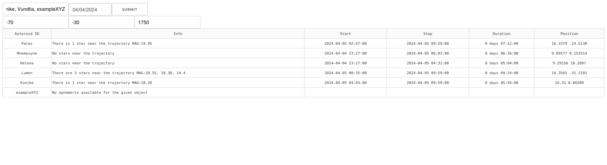
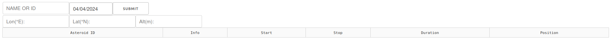

# AsteroidSafeScope
Protecting Observations from Stellar Interference 

AsteroidSafeScope is a tool designed for swift verification during asteroid observation planning. It aids in quickly checking if stars are present along the path of an asteroid, facilitating efficient observation planning.



## Requirements
- Python 3.10+
- Docker

## Usage

To utilize AsteroidSafeScope:
- Enter the longitude, latitude, and altitude of the observation location.
- Provide the asteroid names or their IDs, separated by commas, for analysis.
- Select the observation date using the calendar feature.
- Confirm the selection to initiate the verification process.


## Installation (Development)

### For development usage:

Download code:
```commandline
git clone https://github.com/janandrzejewski/AsteroidSafeScope
```
install docker and compose plugin
- https://docs.docker.com/engine/install/
- https://docs.docker.com/compose/install/linux/#install-the-plugin-manually

Run the server:

```commandline
sudo docker compose up -d --build
```

## Development

Imports are organized with `isort`.

Code is formatted with `black`.


